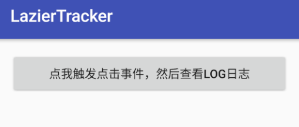
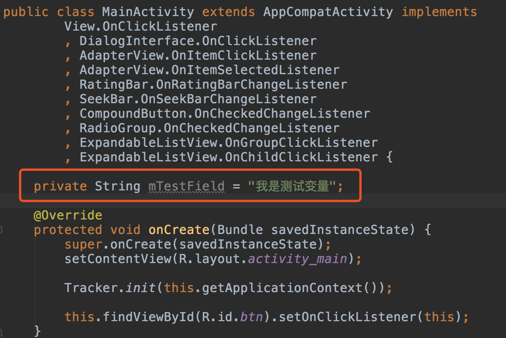
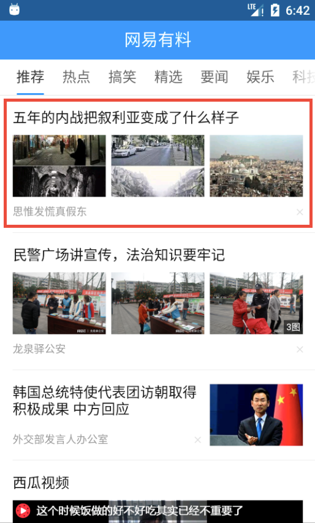
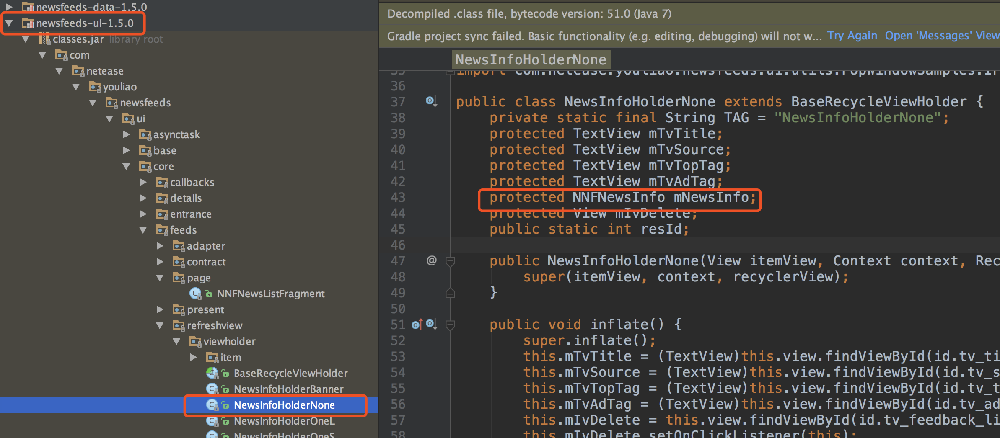

# 简介
本项目通过Android字节码插桩插件实现Android端无埋点（或自动埋点），并且支持根据配置文件实现业务数据的自动采集。

为便于大家深入理解Android字节码插桩插件，特别梳理了一篇文章[应用于Android无埋点的Gradle插件解析](https://www.jianshu.com/p/250c83449dc0)，供大家参考。

# 无埋点插件

## 原理

试想一下我们代码埋点的过程：首先定位到事件响应函数，例如Button的onClick函数，然后在该事件响应函数中调用SDK数据搜集接口。

我们的gradle插件采用 Android gradle 插件提供的最新的Transform API，在Apk编译环节中、class打包成dex之前，插入了中间环节，调用 ASM API对class文件的字节码进行扫描，当扫描到目标事件响应函数时，在函数头部或尾部插入SDK数据搜集代码。

## 开发环境
- 语言：Groovy
- 字节码操作库：ASM5.0
- 工具：Android Studio 2.3.3(Mac)
- Gradle：1.5+

**注意事项**

在AS 3.0中，需要在`project`的 `gradle.properties`中添加

```java
android.enableD8=true
```

## 使用

使用Android字节码插桩插件，您可能需要做些自定义的配置，比如在`ReWriterConfig`中配置注入代码的类名及待注入的方法映射

例如

	public static String sAgentClassName = 'com/codeless/tracker/PluginAgent'
	
	sInterfaceMethods.put('onClick(Landroid/view/View;)V', new MethodCell(
	                'onClick',
	                '(Landroid/view/View;)V',
	                'android/view/View$OnClickListener',
	                'onClick',
	                '(Landroid/view/View;)V',
	                1, 1,
	                [Opcodes.ALOAD]))
上述代码表明当一个`Activity`或`Fragment`实现了`View$OnClickListener`接口时，使用本插件遍历到该`Activity`或`Fragment`字节码中的`onClick(View v)`时，向该方法中插入`com.codeless.tracker.PluginAgent.onClick(v)`。`com.codeless.tracker.PluginAgent`中的`onClick(View v)`方法即是您想要注入到点击事件响应`onClick`中的代码。

### 1. 本地插件集成       

`app`的`build.grade`中添加
	
	// 直接引用buildsrc的插件类
	apply plugin: com.codeless.plugin.InjectPluginImpl

### 2. 自定义参数

`app`的`build.grade`中添加如下代码，各配置项的含义请参考英文注释

```
codelessConfig {
    //this will determine the name of this plugin transform, no practical use.
    pluginName = 'myPluginTest'
    //turn this on to make it print help content, default value is true
    showHelp = true
    //this flag will decide whether the log of the modifying process be printed or not, default value is false
    keepQuiet = false
    //this is a kit feature of the plugin, set it true to see the time consume of this build
    watchTimeConsume = false

    //this is the most important part, 3rd party JAR packages that want our plugin to inject;
    //our plugin will inject package defined in 'AndroidManifest.xml' and 'butterknife.internal.butterknife.internal.DebouncingOnClickListener' by default.
    //structure is like ['butterknife.internal','com.a.c'], type is HashSet<String>.
    //You can also specify the name of the class;
    //example: ['com.xxx.xxx.BaseFragment']
    targetPackages = []
}
```

### 3. 远程插件集成

这一步需要您修改好`ReWriterConfig`后，发布插件到远程仓库，然后在app中引用远程插件。具体步骤请参考[Codeless-Gradle-Plugin-Repo](https://github.com/nailperry-zd/Codeless-Gradle-Plugin-Repo)

## 支持插桩的目标方法

### 1. 目标方法在Fragment中声明

目标方法：

- onResume()V
- onPause()V
- setUserVisibleHint(Z)V
- onHiddenChanged(Z)V

具体实现：

- 对app中指定包进行扫描，筛选出所有父类为`android/app/Fragment`或`android/support/v4/app/Fragment`的类。
- 对这些Fragment子类的`onResumed`，`onPaused`，`onHiddenChanged`，`setFragmentUserVisibleHint`方法的字节码进行修改，添加数据采集代码。

目标效果：

```
public class BaseFragment extends Fragment {
    public BaseFragment() {
    }

    public void onResume() {
        super.onResume();
        PluginAgent.onFragmentResume(this);
    }

    public void onHiddenChanged(boolean var1) {
        super.onHiddenChanged(var1);
        PluginAgent.onFragmentHiddenChanged(this);
    }

    public void onPause() {
        super.onPause();
        PluginAgent.onFragmentPause(this);
    }

    public void setUserVisibleHint(boolean var1) {
        super.setUserVisibleHint(var1);
        PluginAgent.setFragmentUserVisibleHint(this, var1);
    }
}
```

### 2. 目标方法在接口中声明

目标方法：

- onClick(Landroid/view/View;)V
- onClick(Landroid/content/DialogInterface;I)V
- onItemClick(Landroid/widget/AdapterView;Landroid/view/View;IJ)V
- onItemSelected(Landroid/widget/AdapterView;Landroid/view/View;IJ)V
- onGroupClick(Landroid/widget/ExpandableListView;Landroid/view/View;IJ)Z
- onChildClick(Landroid/widget/ExpandableListView;Landroid/view/View;IIJ)Z
- onRatingChanged(Landroid/widget/RatingBar;FZ)V
- onStopTrackingTouch(Landroid/widget/SeekBar;)V
- onCheckedChanged(Landroid/widget/CompoundButton;Z)V
- onCheckedChanged(Landroid/widget/RadioGroup;I)V
- ...

具体实现：

- 对app中指定包进行扫描，筛选出实现了目标接口的类，在目标方法中添加数据采集代码。

> 例如，筛选出实现了`android/view/View$OnClickListener`接口的类，然后在`onClick(Landroid/view/View;)V`方法中注入采集数据的代码。

目标效果：

```
public class MainActivity extends AppCompatActivity implements OnClickListener, android.content.DialogInterface.OnClickListener, OnItemClickListener, OnItemSelectedListener, OnRatingBarChangeListener, OnSeekBarChangeListener, OnCheckedChangeListener, android.widget.RadioGroup.OnCheckedChangeListener, OnGroupClickListener, OnChildClickListener {
    public MainActivity() {
    }

    protected void onCreate(Bundle var1) {
        super.onCreate(var1);
        this.setContentView(2130968603);
    }

    public void onClick(View var1) {
        PluginAgent.onClick(var1);
    }

    public void onClick(DialogInterface var1, int var2) {
        PluginAgent.onClick(this, var1, var2);
    }

    public void onItemClick(AdapterView<?> var1, View var2, int var3, long var4) {
        PluginAgent.onItemClick(this, var1, var2, var3, var4);
    }

    public void onItemSelected(AdapterView<?> var1, View var2, int var3, long var4) {
        PluginAgent.onItemSelected(this, var1, var2, var3, var4);
    }

    public void onNothingSelected(AdapterView<?> var1) {
    }

    public void onCheckedChanged(CompoundButton var1, boolean var2) {
        PluginAgent.onCheckedChanged(this, var1, var2);
    }

    public boolean onChildClick(ExpandableListView var1, View var2, int var3, int var4, long var5) {
        PluginAgent.onChildClick(this, var1, var2, var3, var4, var5);
        return false;
    }

    public boolean onGroupClick(ExpandableListView var1, View var2, int var3, long var4) {
        PluginAgent.onGroupClick(this, var1, var2, var3, var4);
        return false;
    }

    public void onCheckedChanged(RadioGroup var1, int var2) {
        PluginAgent.onCheckedChanged(this, var1, var2);
    }

    public void onRatingChanged(RatingBar var1, float var2, boolean var3) {
        PluginAgent.onRatingChanged(this, var1, var2, var3);
    }

    public void onProgressChanged(SeekBar var1, int var2, boolean var3) {
    }

    public void onStartTrackingTouch(SeekBar var1) {
    }

    public void onStopTrackingTouch(SeekBar var1) {
        PluginAgent.onStopTrackingTouch(this, var1);
    }
}
```

## ASM语法实战

[目标方法对应的ASM字节码操作](/bytecodes.md)

# 业务数据采集

业务数据的采集需要下发json格式的配置文件，该文件本该由埋点服务器下发。这里为了演示方便，将配置文件放在`tracker`模块的`assets`目录下。

[configure.json](https://github.com/nailperry-zd/LazierTracker/blob/master/tracker/src/main/assets/configure.json)

## 示例1

假设页面布局如下：



根据我们的ViewPath计算规则（参考[网易HubbleData之Android无埋点实践](https://www.jianshu.com/p/8459a75ce5ca)），可知该按钮的ViewPath为：

```java
/MainWindow/ContentFrameLayout[0]#android:content/RelativeLayout[0]#activity_main/AppCompatButton[0]#btn
```

现在希望点击按钮后，搜集该按钮所在Activity的成员变量`mTestField`的值，如下图所示：



根据网易乐得提出的数据路径DSL语言规则（参考[Android无埋点数据收集SDK关键技术](https://www.jianshu.com/p/b5ffe845fe2d)），可知变量`mTestField`的数据引用路径应该表示为`this.context.mTestField`。

因此，上述业务数据搜集需求可用如下配置表示：

```java
{
  "pageName": "MainActivity",
  "viewPath": "/MainWindow/ContentFrameLayout[0]#android:content/RelativeLayout[0]#activity_main/AppCompatButton[0]#btn",
  "eventType": "viewClick",
  "dataPath": "this.context.mTestField"
}
```

运行工程，触发事件，无埋点采集到的数据效果如下：

```java
D/LazierTracker: 成功打点事件->@eventId = 73acfdf0c708e1dc3f90f4611da2569167872469c6ae697e51688fa7207eef62
D/LazierTracker: attributes@businessData = 我是测试变量
D/LazierTracker: attributes@viewPath = /MainWindow/ContentFrameLayout[0]#android:content/RelativeLayout[0]#activity_main/AppCompatButton[0]#btn
D/LazierTracker: attributes@pageName = MainActivity
```

## 示例2

如图所示：



该页面列表由RecyclerView实现，红框圈住的视图为RecyclerView的第0个item，该视图对应的ViewPath为：

```java
MainWindow/ContentFrameLayout[0]#android:content/LinearLayout[0]#root_view/FrameLayout[0]#content_view/FrameLayout[0]#fragment_container/NNFeedsFragment[0]/FrameLayout[0]#content_view/LinearLayout[0]/NoScrollViewPager[0]#view_pager/NNFNewsListFragment[0]/FrameLayout[0]#content_view/FrameLayout[0]#list_fragment_container/NNFSmartRefreshLayout[0]#refreshLayout/RecyclerView[0]#rrv_news_infos/LinearLayout[0]
```

现在希望点击按钮后，搜集该视图中新闻的`infoId`，变量`infoId`未展示在界面上，但在内存中。为了拿到该变量值，需要拿到该视图对应的数据源。做法是，先拿到`RecyclerView`第0项的`ViewHolder`，看代码可知是`NewsInfoHolderTriS`，而`NewsInfoHolderTriS`继承`NewsInfoHolderNone`，该视图对应的数据源即是`NewsInfoHolderNone`中的成员变量`mNewsInfo`，如下图所示：



`mNewsInfo`中包含具体的`infoId`、`title`等字段，按此描述，数据引用路径应该为`item.mNewsInfo.infoId`&`item.mNewsInfo.title`

因此，上述业务数据搜集需求可用如下配置表示：

```java
{
  "pageName": "SampleFeedsActivity",
  "viewPath": "/MainWindow/ContentFrameLayout[0]#android:content/LinearLayout[0]#root_view/FrameLayout[0]#content_view/FrameLayout[0]#fragment_container/NNFeedsFragment[0]/FrameLayout[0]#content_view/LinearLayout[0]/NoScrollViewPager[0]#view_pager/NNFNewsListFragment[0]/FrameLayout[0]#content_view/FrameLayout[0]#list_fragment_container/NNFSmartRefreshLayout[0]#refreshLayout/RecyclerView[0]#rrv_news_infos/LinearLayout[0]",
  "eventType": "viewClick",
  "dataPath": "item.mNewsInfo",
  "subPath": [
    "infoId",
    "title"
  ]
}
```

运行工程，触发事件，无埋点采集到的数据效果如下：

```java
D/LazierTracker: 成功打点事件->@eventId = b9f3be79bad49fb69fc7508f79702fc044da4d2e695432d9df0b62a41c37c740
D/LazierTracker: attributes@infoId = II2TH7RYJ1VOUR0
D/LazierTracker: attributes@viewPath = /MainWindow/ContentFrameLayout[0]#android:content/LinearLayout[0]#root_view/FrameLayout[0]#content_view/FrameLayout[0]#fragment_container/NNFeedsFragment[0]/FrameLayout[0]#content_view/LinearLayout[0]/NoScrollViewPager[0]#view_pager/NNFNewsListFragment[0]/FrameLayout[0]#content_view/FrameLayout[0]#list_fragment_container/NNFSmartRefreshLayout[0]#refreshLayout/RecyclerView[0]#rrv_news_infos/LinearLayout[0]
D/LazierTracker: attributes@title = 五年的内战把叙利亚变成了什么样子
D/LazierTracker: attributes@pageName = SampleFeedsActivity
```

**viewPath支持正则匹配**

针对`RecyclerView`item的业务数据采集，不建议为每个item进行配置，而是抽取item共性，采用正则表达式构造viewPath，使用正则表达式时，一个viewPath可匹配多个控件。

例如，本例中的viewPath可以改为
`.*rrv_news_infos/(LinearLayout|RelativeLayout)\\[[0-9]+\\]$`，从而匹配所有频道的新闻列表item。整体配置如下：

```java
{
  "pageName": "SampleFeedsActivity",
  "viewPath": ".*rrv_news_infos/(LinearLayout|RelativeLayout)\\[[0-9]+\\]$",
  "eventType": "viewClick",
  "dataPath": "item.mNewsInfo",
  "subPath": [
    "infoId",
    "title"
  ]
}
```

## 待续

无埋点采集业务数据功能仍在探索中...

# 致谢

1. 本项目`buildsrc`模块是字节码插桩插件源码，其开发灵感来源于开源项目[HiBeaver](https://github.com/BryanSharp/hibeaver)。特此感谢。
2. 业务数据采集原理参考网易乐得方案[Android无埋点数据收集SDK关键技术](https://www.jianshu.com/p/b5ffe845fe2d)。特此感谢。
3. 为验证无埋点对复杂业务数据的采集效果，本项目`app`模块引入了[网易有料Android UI SDK演示demo](https://github.com/NetEaseYouliao/NewsFeeds-UI-Demo-Android)的部分示例代码，用于测试复杂业务场景。特此感谢。